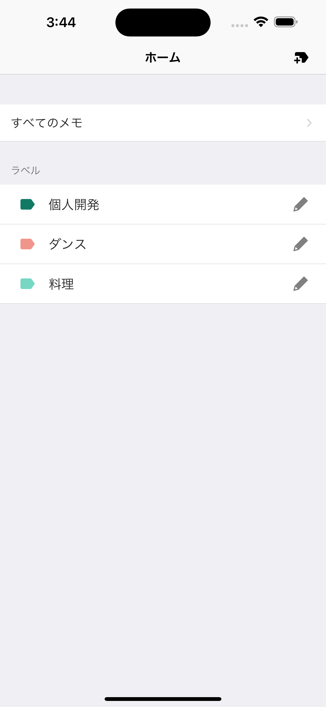
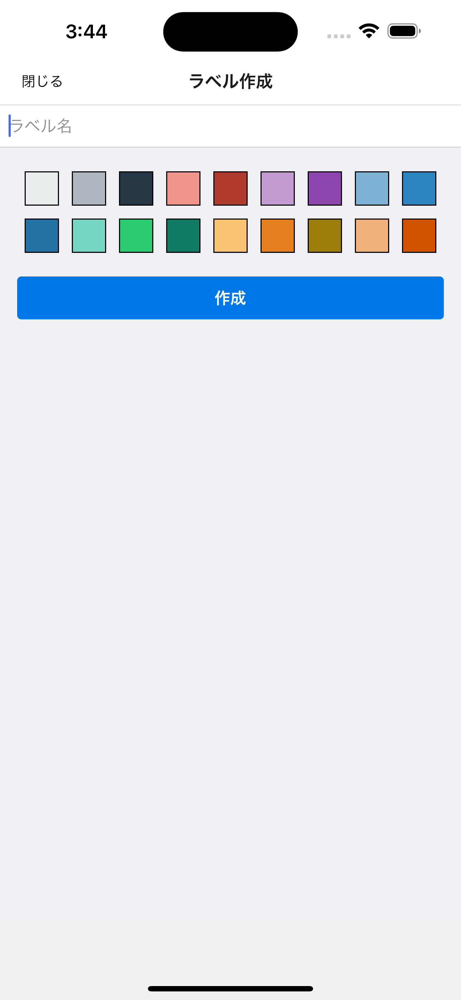
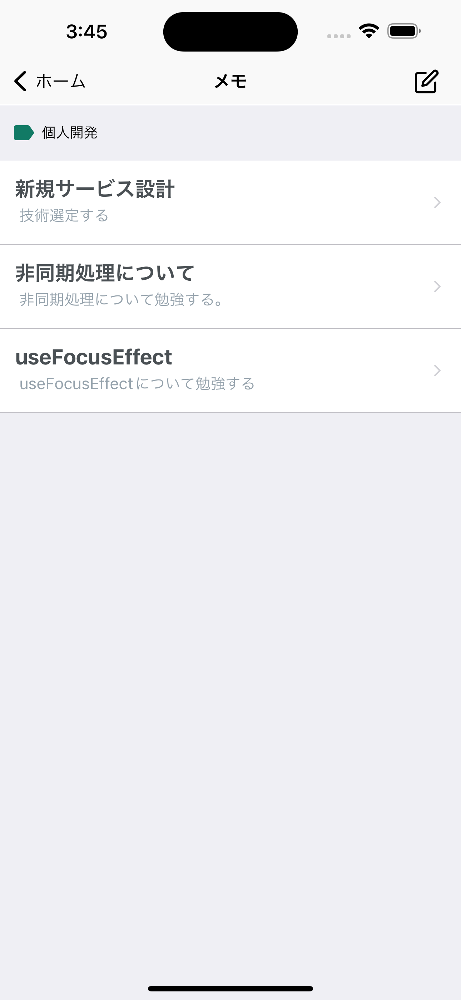
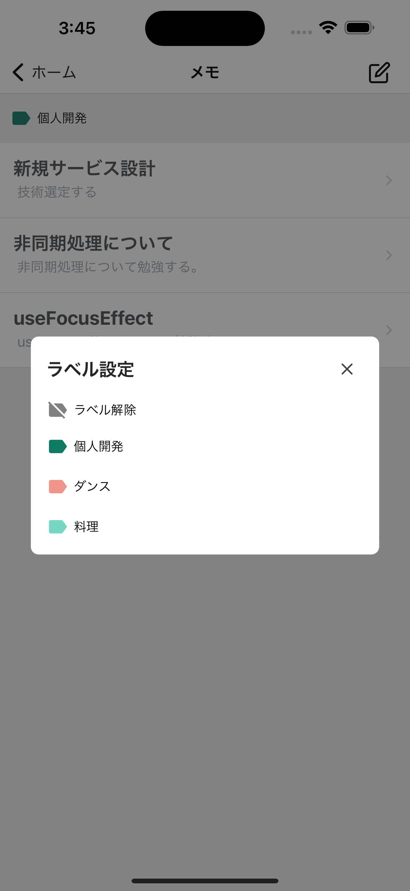

# 📝 expo-memo-app  メモ管理アプリ

メモを作成・編集・削除できるシンプルなメモアプリです。  
ラベルを作成しメモに付与させることができます。  
※参考にさせていただいた講座: [📝](https://www.udemy.com/course/react-native-memo/learn/lecture/48711855#overview)  

---

## 画面キャプチャ

| ホーム | ラベル作成 | メモ一覧 | ラベル設定 |
|---|---|---|---|
|  |  |  |  |

---

## デモ動画


---

## 使用技術
- **React Native**
- **Expo**
- **TypeScript**
- **React Navigation**
- **SQLite（ローカルデータ保存）**

---

## 導入方法
```sh
git clone https://github.com/saorkz007/expo-memo-app.git
cd expo-memo-app
npx expo start --clean
